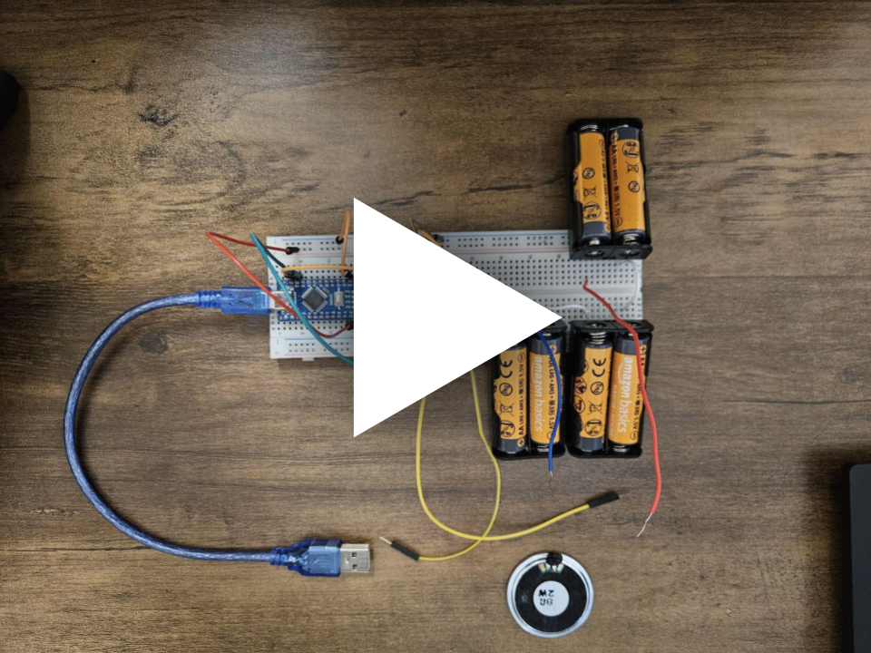

# Arduino-Powered Portable Speaker

## Overview
This project is an **Arduino-powered portable speaker**, designed to be a **self-contained, battery-operated audio device**. The speaker utilizes the **DFPlayer Mini** module to play audio files directly from an **SD card**, with automatic track looping for continuous playback.

Powered by **6 AA batteries**, this speaker is easy to maintain and allows for quick battery replacement. 

Originally this speaker was conceived as a *fun project to attach to a Roomba*, to get the roomba to say *"OW"* on impact with furniture

## Concept & Inspiration
The idea for this portable speaker originated from collaborative discussions with **Jackson Bowles, Alex Anthony, and Brenden Mahoney**, exploring potential startup ventures. Through brainstorming and feedback, the design evolved into a compact, user-friendly device focused on convenience and functionality.

## Features
- Self-contained, battery-powered design  
- Audio playback directly from an SD card  
- Automatic track looping  
- Quick and simple battery replacement  
- Arduino-based control using the **DFPlayer Mini** module  
- Portable and adaptable to multiple use cases beyond the original concept  

## Media
### Demo Video – “OW!” Clip

     
    
     
     
    <i>Early Build of the Portable Speaker</i>

## Hardware
- Arduino (specify model)  
- DFPlayer Mini MP3 module  
- 6 × AA batteries  
- Speaker (specify size/impedance)  
- Supporting components (resistors, wires, etc.)  

## Circuit Diagram
Below is the **network connection diagram** for the portable Arduino speaker:

  

## Setup Instructions
1. **Insert the SD card** containing audio files into the DFPlayer Mini.  
2. **Connect the hardware** according to the circuit diagram.  
3. **Power the system** using 6 AA batteries.  
4. **Upload the Arduino sketch** to the Arduino board.  
5. **Play audio** directly or attach the speaker to another device for interactive or humorous effects, such as the "OW" clip demonstrated above.

---
